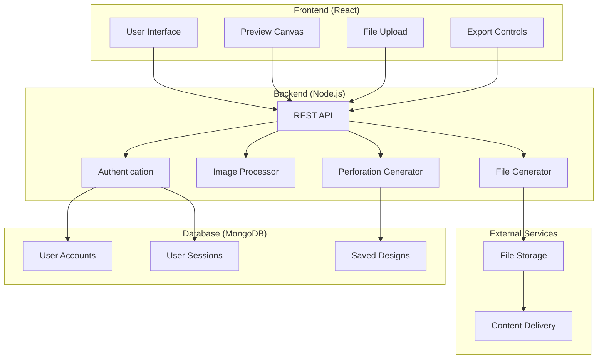

# Architecture Documentation - RhinoPerforatedWall

## System Overview

The RhinoPerforatedWall application is a full-stack web application that generates customized perforated panels based on user-uploaded halftone pattern images. The system processes images to create perforation patterns suitable for CNC machining, laser cutting, and digital fabrication.

## Technology Stack

### Frontend
- **Framework**: React 18 with TypeScript
- **Build Tool**: Vite for fast development and optimized builds
- **Styling**: Tailwind CSS for responsive design
- **State Management**: React Context API with useReducer
- **Canvas Rendering**: HTML5 Canvas API for real-time preview
- **File Handling**: File API for image uploads
- **HTTP Client**: Axios for API communication

### Backend
- **Runtime**: Node.js 18+
- **Framework**: Express.js with TypeScript
- **Database**: MongoDB with Mongoose ODM
- **Authentication**: JWT (JSON Web Tokens)
- **Image Processing**: Sharp for image manipulation
- **File Generation**: 
  - dxf-writer for DXF export
  - svg.js for SVG generation
  - jsPDF for PDF creation
- **Validation**: Joi for request validation
- **Security**: Helmet, CORS, rate limiting

### Development Tools
- **Package Manager**: npm
- **Testing**: Jest for unit tests, Cypress for E2E
- **Code Quality**: ESLint, Prettier
- **Type Checking**: TypeScript strict mode
- **Documentation**: JSDoc for code documentation

## System Architecture



## Data Flow

### Image Processing Pipeline
1. User uploads halftone image (JPEG/PNG/SVG)
2. Frontend validates file type and size
3. Image sent to backend Image Processor
4. Sharp library converts to grayscale
5. Pixel data analyzed for density mapping
6. Perforation coordinates calculated
7. Preview data sent to frontend Canvas

### Real-Time Preview
1. User adjusts parameters (size, spacing, shape)
2. Frontend debounces changes (300ms delay)
3. Parameters sent to Perforation Generator
4. New coordinates calculated
5. Canvas re-renders with updated pattern
6. Zoom/pan/rotate applied to viewport

### File Export Process
1. User selects export format (DXF/SVG/PDF)
2. Final parameters validated
3. File Generator creates output file
4. File temporarily stored
5. Download link provided to user
6. Temporary file cleaned up after 1 hour

## API Design

### Authentication Endpoints
- `POST /api/auth/register` - User registration
- `POST /api/auth/login` - User login
- `POST /api/auth/logout` - User logout
- `GET /api/auth/profile` - Get user profile

### Image Processing Endpoints
- `POST /api/images/upload` - Upload and analyze image
- `GET /api/images/:id` - Get processed image data
- `DELETE /api/images/:id` - Delete uploaded image

### Perforation Generation Endpoints
- `POST /api/perforations/generate` - Generate perforation pattern
- `PUT /api/perforations/:id` - Update pattern parameters
- `GET /api/perforations/:id/preview` - Get preview data

### Design Management Endpoints
- `POST /api/designs` - Save design
- `GET /api/designs` - List user designs
- `GET /api/designs/:id` - Get specific design
- `PUT /api/designs/:id` - Update design
- `DELETE /api/designs/:id` - Delete design

### Export Endpoints
- `POST /api/export/dxf` - Generate DXF file
- `POST /api/export/svg` - Generate SVG file
- `POST /api/export/pdf` - Generate PDF file
- `GET /api/export/:id/download` - Download generated file

## Database Schema

### Users Collection
```javascript
{
  _id: ObjectId,
  email: String (unique, required),
  password: String (hashed, required),
  firstName: String (required),
  lastName: String (required),
  createdAt: Date,
  updatedAt: Date,
  isActive: Boolean
}
```

### Designs Collection
```javascript
{
  _id: ObjectId,
  userId: ObjectId (ref: Users),
  name: String (required),
  description: String,
  imageId: String,
  parameters: {
    panelWidth: Number, // inches
    panelHeight: Number, // inches
    minHoleSize: Number, // inches
    maxHoleSize: Number, // inches
    shape: String, // circle, rectangle, polygon, custom
    pattern: String, // grid, staggered, random
    horizontalSpacing: Number, // inches
    diagonalSpacing: Number, // inches
    rotation: Number // degrees
  },
  perforationData: {
    coordinates: [{
      x: Number,
      y: Number,
      size: Number,
      shape: String
    }],
    totalHoles: Number,
    coverage: Number // percentage
  },
  createdAt: Date,
  updatedAt: Date,
  isPublic: Boolean
}
```

### Sessions Collection
```javascript
{
  _id: ObjectId,
  userId: ObjectId (ref: Users),
  token: String (required),
  expiresAt: Date (required),
  createdAt: Date,
  ipAddress: String,
  userAgent: String
}
```

## Security Considerations

### Authentication & Authorization
- JWT tokens with 24-hour expiration
- Refresh token mechanism
- Password hashing with bcrypt (12 rounds)
- Rate limiting on authentication endpoints

### Input Validation
- File type validation (MIME type checking)
- File size limits (max 10MB for images)
- Parameter range validation
- SQL injection prevention with Mongoose

### Data Protection
- HTTPS enforcement in production
- CORS configuration for allowed origins
- Helmet.js for security headers
- Input sanitization for all user data

## Performance Optimization

### Frontend
- Code splitting with React.lazy()
- Image compression before upload
- Canvas rendering optimization
- Debounced parameter updates
- Virtual scrolling for design lists

### Backend
- Database indexing on frequently queried fields
- Image processing caching
- File generation result caching
- Connection pooling for MongoDB
- Compression middleware for responses

### Infrastructure
- CDN for static assets
- Load balancing for multiple instances
- Database read replicas
- File storage with automatic cleanup

## Deployment Architecture

### Development Environment
- Local MongoDB instance
- Node.js development server
- React development server with HMR
- File storage in local filesystem

### GitHub Pages Deployment (Static Mode)
- **Frontend**: Deployed to GitHub Pages with automated CI/CD
- **Build Process**: GitHub Actions workflow triggers on push to main/master
- **Static Mode**: Frontend operates in static deployment mode with mock data
- **Base Path**: Configured for `/RhinoPerforatedWall/` repository path
- **Workflow**: 
  - Node.js 18 setup
  - Dependencies installation
  - TypeScript compilation and Vite build
  - Artifact upload and deployment to GitHub Pages
- **URL**: Accessible at `https://[username].github.io/RhinoPerforatedWall/`

### Production Environment
- MongoDB Atlas cluster
- Node.js application on cloud platform
- React build served via CDN
- Cloud file storage (AWS S3/Azure Blob)
- SSL/TLS termination at load balancer

## Monitoring & Logging

### Application Monitoring
- Error tracking with structured logging
- Performance metrics collection
- User activity analytics
- API response time monitoring

### Health Checks
- Database connectivity checks
- File storage accessibility
- Memory and CPU usage monitoring
- Automated alerting for critical issues